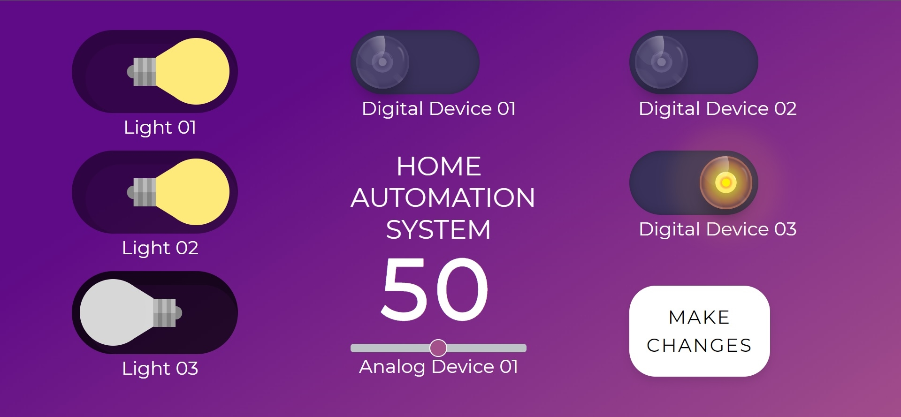
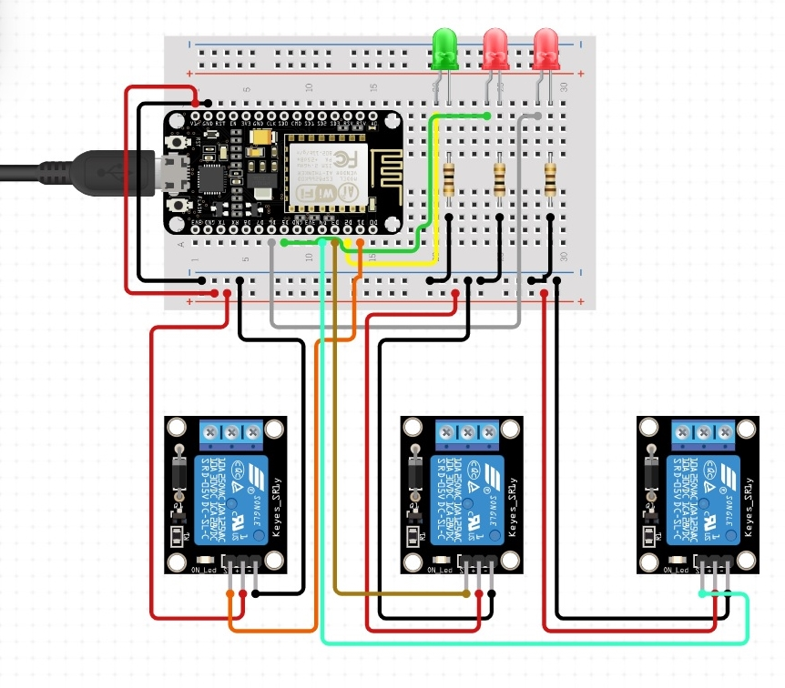

# Static Home-automation System

Home Automation System is Flask based Internet of Things (IoT) static application that changes the state of various device and appliances based on user input.



[STATIC HOME AUTOMATION SYSTEM](http://statichomeautomation.herokuapp.com/)

[API Endpoint](http://statichomeautomation.herokuapp.com/api)

---

The following technologies are ued to accompalish this project

## Software

1. Frontend

   - HTML
   - CSS

2. Backend

   - Flask (Python)

3. Storage

   - File System
   - JSON

4. Deployment
   - Heroku

## Hardware

| Slno | Components                        | Specifications               | Quantity            |
| ---- | --------------------------------- | ---------------------------- | ------------------- |
| 1    | Wifi Module Based Microcontroller | Node MCU                     | 1                   |
| 2    | LED's                             | Various Colors (3.3 V)       | 3                   |
| 3    | Relay                             | DC 5V Relay Module           | 3                   |
| 4    | Power Source                      | Battery (9V)                 | 1                   |
| 5    | Resistors                         | 330 $\Omega$                 | 3                   |
| 6    | Jumper Wires                      | Male to Male, Male to Female | As many as required |

## Circuit



## Pin Connection

| Pin Name                 | Pin Number   |
| ------------------------ | ------------ |
| digitaldevices_digital01 | D1 (GPIO 05) |
| digitaldevices_digital02 | D3 (GPIO 00) |
| digitaldevices_digital03 | D4 (GPIO 02) |
| lights_light01           | D6 (GPIO 12) |
| lights_light02           | D5 (GPIO 14) |
| lights_light03           | D2 (GPIO 40) |

## Set up

```cmd
git clone https://github.com/SHESHANKSK/statichomeautomation.git
cd statichomeautomation

```

```cmd
pip install mkvirtualenv
```

```cmd
mkvirtualenv <name of virtual environment>
workon <name of virtual environment>
```

```cmd
pip install -r requirements.txt
```

```cmd
flask run
OR
python app.py
```

## Wifi and Endpoint Configurations

main.ino file

Change the name of your wifi and password

```cpp
const char *wifiName = "wifiname";
const char *wifiPass = "password";
```

Deploy your flask app and get get the api link and change

```cpp
const char *host = "write the endpoint where your api is exposed";
```

## Deployment

**Platform Used** : Heroku

```cmd
heroku login
heroku create <name of your app>
git push heroku master
```
